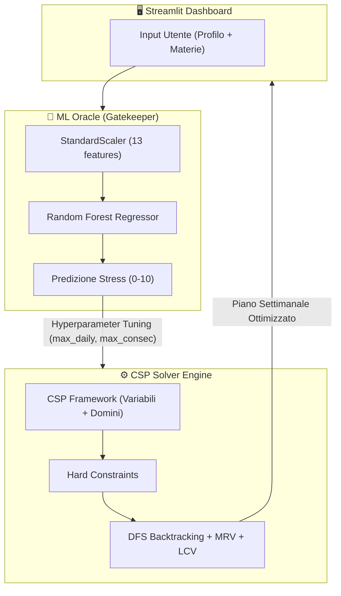

<p align="center">
  
</p>

<h1 align="center">🧘 ZenPlanner</h1>

<p align="center">
  <b>Scheduler Adattivo Intelligente per Studenti</b><br>
  <i>Ottimizzazione del tempo, prevenzione dello stress e Machine Learning</i>
</p>

<p align="center">
  
  
  
  
</p>

---

## 🚀 Prova l'App

Vuoi vedere ZenPlanner in azione? Accedi alla demo live direttamente nel tuo browser:

<p align="center">
  <a href="https://kekkocoppola.github.io/ZenPlanner/">
    
  </a>
</p>

---

## 🌟 Visione del Progetto

ZenPlanner non è un semplice calendario. È un assistente basato su **Intelligenza Artificiale** progettato per bilanciare il carico accademico con il benessere mentale. Attraverso un modello di **Machine Learning** (Random Forest Regressor) analizziamo il tuo profilo di stress e adattiamo dinamicamente un motore di **Constraint Satisfaction Problem (CSP)** per generare il piano di studio perfetto per te.

### ✨ Caratteristiche Principali

- 🧠 **Oracolo ML**: Predizione del burnout basata su 13 feature comportamentali.
- ⚙️ **Motore CSP Adattivo**: Generazione di scheduling con euristiche Fail-First (MRV) e Least Constraining Value (LCV).
- 🛡️ **Zen Gaps**: Inserimento automatico di pause basato sul tuo livello di stress predetto.
- 📊 **Dashboard Interattiva**: Gestione intuitiva di task, scadenze e priorità in tempo reale.

---

## 🏗️ Architettura Ibrida

Il core del progetto si basa su un'interazione **bidirezionale** tra l'analisi predittiva e la risoluzione dei vincoli:



### 🧠 Dettagli del Motore CSP

| Componente | Funzione | Strategia |
|:---:|:---|:---|
| **Variabili** | Slot Temporali | Giorno × Ora (atomico) |
| **Domini** | Sessioni di Studio | Dinamici in base alla priorità |
| **Euristica Selezione** | **MRV** | Minimizzazione dei valori residui per pruning veloce |
| **Euristica Valore** | **LCV** | Minimizzazione della varianza oraria settimanale |
| **Vincoli** | Hard Constraints | Scadenze, No-Overlap, Daily Max, Contiguità |

---

## 📁 Struttura della Repository

```bash
ZenPlanner/
├── 📊 analytics/              # Grafici RMSE, Feature Importance e SHAP
├── 🎨 assets/                 # Brand identity e risorse grafiche
├── 💾 data/                   # Dataset originali e preprocessati
├── 📂 src/
│   ├── 🧠 ml_pipeline/        # Training, Preprocessing e XAI
│   ├── ⚙️ csp_scheduler/      # Motore CSP e Logic Layer
│   └── 🖥️ api_dashboard/      # Frontend Streamlit (app.py)
├── 🧪 tests/                  # Suite di test automatizzati
└── 📄 requirements.txt        # Dipendenze del progetto
```

---

## ⚡ Setup Veloce

Per eseguire ZenPlanner localmente, segui questi passaggi:

```bash
# 1. Clona il repository
git clone https://github.com/KekkoCoppola/ZenPlanner.git
cd ZenPlanner

# 2. Installa le dipendenze
pip install -r requirements.txt

# 3. Addestra il modello (necessario al primo avvio)
python src/ml_pipeline/preprocess_data.py
python src/ml_pipeline/train_model.py

# 4. Lancia la Dashboard
streamlit run src/api_dashboard/app.py
```

---

## 👥 Il Nostro Team

Studenti di Informatica presso l'**Università degli Studi di Salerno**.

<table align="center">
  <tr>
    <td align="center">
      <a href="https://github.com/KekkoCoppola">
        <br />
        <sub><b>Francesco Coppola</b></sub>
      </a>
    </td>
    <td align="center">
      <a href="https://github.com/rosx3">
        <br />
        <sub><b>Rosaria Cervino</b></sub>
      </a>
    </td>
    <td align="center">
      <a href="https://github.com/elesshhhh">
        <br />
        <sub><b>Elena Carlomagno</b></sub>
      </a>
    </td>
  </tr>
</table>

---
<p align="center">Made with ❤️ by ZenPlanner Team</p>
