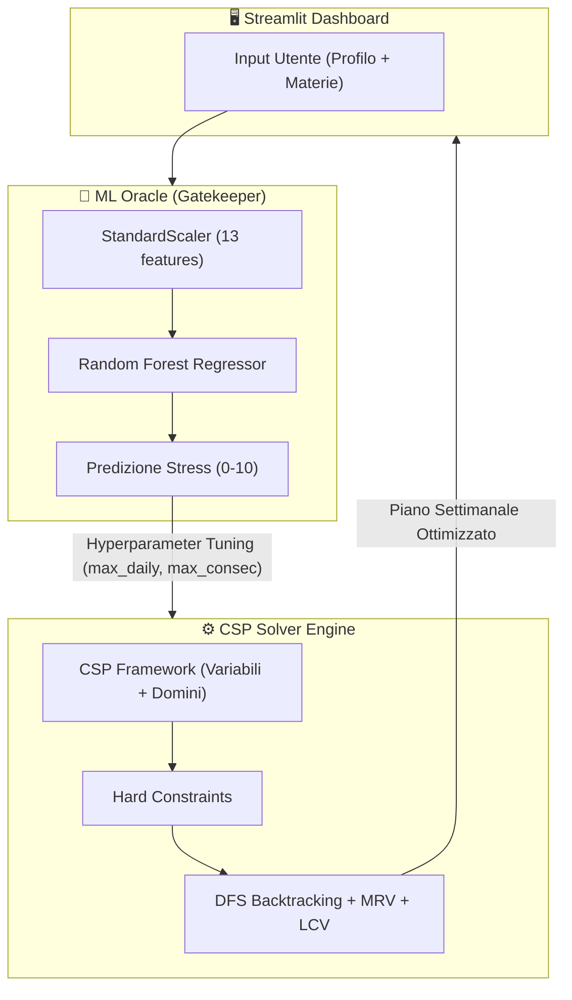

<p align="center">
  
</p>

<h1 align="center">ZenPlanner</h1>

<p align="center">
  <b>Scheduler Adattivo Intelligente · Architettura Neuro-Simbolica</b><br>
  Machine Learning · Constraint Satisfaction · Streamlit Dashboard
</p>

---

ZenPlanner è uno scheduler adattivo intelligente progettato per ottimizzare lo studio e preservare l'equilibrio psicofisico (salute mentale). A differenza dei tradizionali pianificatori statici, ZenPlanner adotta un'architettura **ibrida neuro-simbolica** che combina **Intelligenza Artificiale Simbolica (CSP)** e **Machine Learning (Regressione Predittiva)**. Il sistema genera dinamicamente un piano di studi settimanale che bilancia il carico didattico, massimizzando il rendimento nel rispetto dei limiti di stress individuali.

## 👥 Team

Le menti dietro ZenPlanner. Studenti di Informatica presso l'Università degli Studi di Salerno.

<table align="center">
  <tr>
    <td align="center">
      <br />
      <sub><b>Francesco Coppola</b></sub><br />
      <a href="https://github.com/KekkoCoppola" title="GitHub">💻 GitHub</a>
    </td>
        <td align="center">
      <!-- o -->
      <br />
      <sub><b>Rosaria Cervino</b></sub><br />
      <a href="https://github.com/rosx3" title="GitHub">💻 GitHub</a>
    </td>
        <td align="center">
      <!--  -->
      <br />
      <sub><b>Elena Carlomagno</b></sub><br />
      <a href="https://github.com/elesshhhh" title="GitHub">💻 GitHub</a>
    </td>
  </tr>
</table>

## Architettura Ibrida: Oracolo ML → CSP Engine

Il core del progetto si basa su un'interazione **bidirezionale** tra due motori:



1. **Oracolo ML (Machine Learning Gatekeeper)**: Agisce alla radice dell'albero di ricerca. Valutando olisticamente il profilo studente e il monte ore totale richiesto, effettua una **predizione dello stress a monte**. Se rileva rischio di burnout, innesca un meccanismo di *Hyperparameter Tuning* automatico per il CSP, imponendo vincoli geometrici più stringenti (es. restringendo il Tetto Giornaliero Massimo e le Ore Consecutive) per forzare matematicamente la diluizione della fatica.

2. **CSP Scheduler (Constraint Satisfaction Problem)**: Attraverso algoritmi di ricerca (Backtracking DFS con Forward Checking ed euristiche MRV/LCV), il CSP esplora le combinazioni temporali per allocare le sessioni di studio. Garantisce un piano corretto rispettando vincoli strutturali (hard constraints) come scadenze, nessuna sovrapposizione e tetto massimo dinamico.

---

## Struttura Algoritmica Dettagliata

### `src/csp_scheduler/` — Algorithm Layer

| File | Ruolo | Dettaglio Tecnico |
|------|-------|-------------------|
| **`domain.py`** | Modelli di Dominio | Definisce `UserProfile` (13 feature ML + soglie), `TimeSlot` (variabile atomica immutabile giorno×ora), `StudySession` (variabile CSP con subject, priority, deadline) |
| **`csp.py`** | Framework CSP Generico | Classe astratta `Constraint[V, D]` con metodo `satisfied()`. Classe `CSP[V, D]` che gestisce Variabili, Domini e coda di Vincoli con `consistent()` per Forward Checking |
| **`constraints.py`** | Hard Constraints | 4 vincoli implementati (vedi tabella sotto) |
| **`solver.py`** | Motore di Ricerca AI | DFS Backtracking con euristiche MRV e LCV (vedi sotto) |
| **`scheduler.py`** | Facade Orchestratrice | `ZenSchedulerEngine`: carica modelli ML, esegue predizione, calibra iperparametri, istanzia il CSP e lancia il solver |

#### Vincoli Implementati (`constraints.py`)

| Constraint | Tipo | Descrizione |
|------------|------|-------------|
| `NoOverlapConstraint` | Hard | Previene accavallamenti temporali tra sessioni (unicità degli slot assegnati) |
| `DeadlineConstraint` | Hard | Garantisce che ogni materia sia completata entro la data dell'esame (`day_of_week ≤ deadline_day`) |
| `DailyMaxHoursConstraint` | Hard | Limita le ore di studio assegnate per singolo giorno. **Parametro `max_hours` dinamicamente tunato dall'ML** |
| `MaxConsecutiveConstraint` | Hard | Impedisce più di `N` ore consecutive senza pausa, forzando "Zen Gaps" nel calendario. **`max_consec` è settato a 1h sotto stress alto, 2h altrimenti** |

#### Euristiche del Solver (`solver.py`)

| Euristica | Fase | Meccanismo |
|-----------|------|------------|
| **MRV** (Minimum Remaining Values) | Selezione variabile | Sceglie la sessione con il minor numero di slot legali rimasti → "Fail-First", pruning logico che riduce drasticamente il branching factor |
| **LCV** (Least Constraining Value) | Ordinamento dominio | Calcola il carico per giorno nel piano parziale e ordina gli slot partendo dai giorni più scarichi → **minimizzazione implicita della varianza settimanale** (anti-cramming) |

#### Flusso del Tuning ML → CSP (`scheduler.py`)

```
predict_baseline_stress(total_hours) → stress_score (0-10)

if stress > soglia_utente (default 6.0):
    max_daily_hours -= 2     (minimo 2h/giorno)
    max_consecutive = 1h     (pausa forzata ogni ora)
else:
    max_consecutive = 2h     (distribuzione standard)
    
→ iniezione automatica vincoli calibrati nel CSP
```

---

### `src/ml_pipeline/` — Data Science & Modelli

| File | Ruolo | Dettaglio Tecnico |
|------|-------|-------------------|
| **`preprocess_data.py`** | ETL & Feature Engineering | Outlier Removal, creazione `Work_Rest_Ratio` e `Social_Exercise_Ratio`, One-Hot Encoding coping mechanisms, **Train/Test Split PRIMA dello scaling** (anti data-leakage), `StandardScaler` fittato solo su Train |
| **`train_model.py`** | Model Selection & Export | Confronto Cross-Validated (5-Fold) tra Ridge, SVR, Random Forest, XGBoost. Esportazione automatica del miglior modello + feature list via `joblib`. Generazione grafici RMSE e Feature Importance |
| **`retrain_rf.py`** | Quick Retrain | Script dedicato per ri-addestrare rapidamente il Random Forest con iperparametri ottimizzati |
| **`explainability.py`** | XAI & Interpretabilità | Analisi SHAP per spiegabilità delle predizioni del modello |
| **`eda.py`** | Analisi Esplorativa | Distribuzioni, correlazioni e statistiche descrittive del dataset |

#### Pipeline ML Completa

```
Student_Mental_Stress_and_Coping_Mechanisms.csv
    │
    ├─ preprocess_data.py
    │    ├─ Outlier filtering (Study≤80h, Sleep 3-14h)
    │    ├─ Feature Engineering (+2 ratio features)
    │    ├─ Drop biased columns (Gender, Medical, Substance)
    │    ├─ One-Hot Encoding (Coping Mechanisms)
    │    ├─ Train/Test Split (80/20, seed=42)
    │    └─ StandardScaler (fit su Train only) → scaler.pkl
    │
    ├─ train_model.py
    │    ├─ 5-Fold CV: Ridge vs SVR vs RF vs XGBoost
    │    ├─ Best Model Export → tuned_best_model.pkl
    │    ├─ Feature List → model_features.pkl
    │    └─ Analytics: RMSE comparison + Feature Importance plots
    │
    └─ Output → models/
         ├─ tuned_best_model.pkl
         ├─ model_features.pkl
         └─ scaler.pkl
```

---

### `src/api_dashboard/` — User Interface

| File | Ruolo |
|------|-------|
| **`app.py`** | Dashboard Streamlit: login, profilo ML (13 slider), inserimento materie con scadenze, generazione piano via `ZenSchedulerEngine`, visualizzazione calendario settimanale/giornaliero con cards animate e indicatori di stress |

---

## Struttura della Repository

```
ZenPlanner/
├── assets/                   # Logo e risorse grafiche
├── data/
│   ├── *.csv                 # Dataset sorgente
│   └── processed/            # Train/Test sets processati
├── analytics/                # Grafici RMSE, Feature Importance, SHAP
├── src/
│   ├── ml_pipeline/          # Pipeline Machine Learning
│   │   ├── preprocess_data.py
│   │   ├── train_model.py
│   │   ├── retrain_rf.py
│   │   ├── explainability.py
│   │   ├── eda.py
│   │   └── models/           # Artefatti serializzati (.pkl)
│   │       ├── tuned_best_model.pkl
│   │       ├── model_features.pkl
│   │       └── scaler.pkl
│   ├── csp_scheduler/        # Motore CSP + Oracolo ML
│   │   ├── domain.py         # Modelli di Dominio
│   │   ├── csp.py            # Framework CSP Generico
│   │   ├── constraints.py    # 4 Hard Constraints
│   │   ├── solver.py         # DFS Backtracking + MRV + LCV
│   │   └── scheduler.py      # Facade (ML ↔ CSP)
│   └── api_dashboard/        # Frontend Streamlit
│       └── app.py
├── tests/                    # Test suite (pytest)
├── .streamlit/               # Configurazione tema Streamlit
├── requirements.txt
└── README.md
```

## Setup Veloce

```bash
# 1. Installare le dipendenze
pip install -r requirements.txt

# 2. Preprocessing del dataset e training del modello ML
python src/ml_pipeline/preprocess_data.py
python src/ml_pipeline/train_model.py

# 3. Avviare la Dashboard
streamlit run src/api_dashboard/app.py
```

## Dipendenze Principali

| Libreria | Utilizzo |
|----------|----------|
| `pandas`, `numpy` | Data manipulation & numerical operations |
| `scikit-learn` | StandardScaler, Ridge, SVR, Random Forest, Cross-Validation |
| `xgboost` | Gradient Boosting Regressor |
| `matplotlib`, `seaborn` | Grafici analitici e Feature Importance |
| `joblib` | Serializzazione modelli ML e scaler |
| `streamlit` | Frontend interattivo e dashboard |
| `pytest` | Testing automatizzato |
